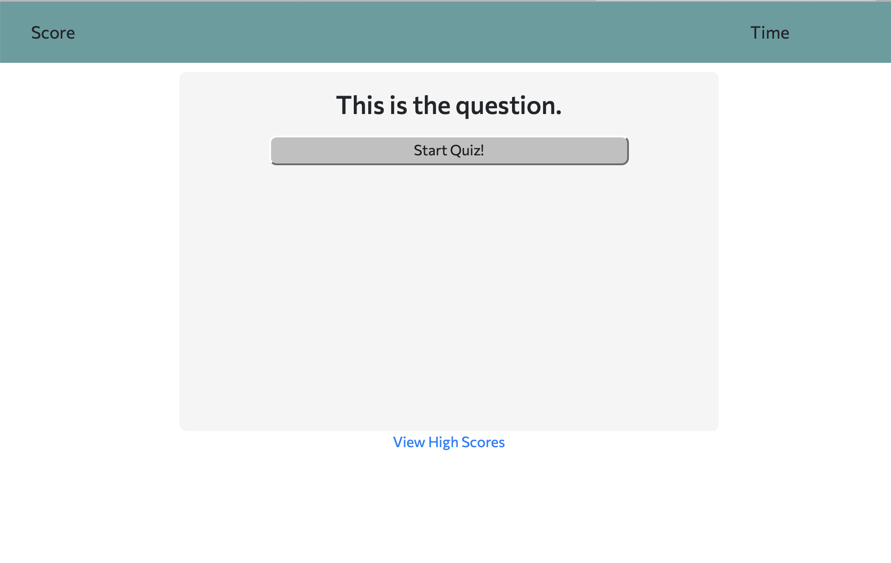

# CodingQuiz

## Coding Quiz HW 3

## Purpose

This website is a fun coding quiz that you can use to test your web development knowledge, with a few suprise questions throw in. To start, just click the start quiz button. If you happen to get a top 5 score, you can save your name to the high score page!

## Scoring

Your final score is determined by how many questions you answer correctly, and how much time is remaining at the end. A correct answer will result in 5 points, and an incorrect answer will take 5 seconds off of the timer. If you finish answering all questions with time left on the clock, that time will be added to your score.

## Screenshot

## How to use

To use, go to the web address listed below.

[Link](https://calebkw91.github.io/CodingQuiz/)
